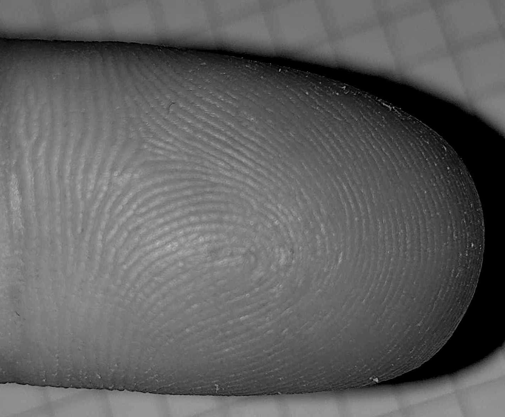

# Praktikum 1 Tobias Rohrer (765357)

## 1.1
```
Neben den diversen Algorithmen und Verfahren ist der Aufnahmevorgang zur Generierung
von Bildern und Videos entscheidend. Machen Sie dazu einen Selbstversuch. Nehmen Sie mit
Ihrer Handykamera eine Ihrer Fingerkuppe so auf, dass man auf dem Bild die Fingerkuppenrillen von den Papillarleisten gut unterscheiden kann. Beschreiben Sie wie Sie vorgegangen
sind, um Ihr Ziel zu erreichen. Erzeugen Sie ein Schwarz-Weiß-Bild, das Ihren Fingerabdruck
deutlich zeigt. Sie können dafür ein Bildverarbeitungsprogramm, wie beispielsweise Gimp,
nutzen. Beschreiben Sie Ihre Vorgehensweise. 
```
Ich habe das Bild vor hellem Hintergrund mit Blitz aufgenommen. Es war wichtig den Finger so auszurichten, dass er fokusiert wird. Vorallem durch den Blitz wurden die Papillarleisten gut erkennbar. Mit dem MacOS Standard-Tool "Preview" habe ich dann nachträglich die Kontraste erhöht und das Bild Schwarz-Weiß umgewandelt.




## 1.2 
```
Im Gegensatz zu den Rillen der Fingerkuppen sind die Rillen des Innengewindes einer
Schraubenmutter sehr gleichmäßig. Wenn Sie optisch überprüfen müssten, ob das Innengewinde gleichmäßig ausgefräst wurde, mit welchem der vorgeschlagen Verfahren würden Sie
beginnen, weil es Ihnen am vielversprechendsten erscheint und welche(s) würden Sie von
vornherein ausschließen? Zur Auswahl stehen: 
• Fourier-Transformation oder ähnliche Abbildungsfunktionen in den Frequenzraum
• Kantendetektor, beispielsweise Laplace oder Sobel
• oder besser den Canny-Edge-Detector
Begründen Sie Ihre Entscheidung. Für diese Aufgabe sollten Sie maximal eine Stunde aufwenden! Es geht darum, sich schnell einen groben
Überblick zu schaffen und nicht darum, die Verfahren vollständig zu
verstehen.
```

### Edge Detection Algorithms
Scheinen auf den ersten Blick sehr gut geeignet. Die Rillen des Innengewindes würden als Kanten erkannt werden. Der Abstand der Kanten zueinander könnte anschließend einfach ermittelt und auf Gleichmäßigkeit überprüft werden. Die Algorithmen sind außerdem in `OpenCV` oder `Pillow` implementiert.

#### Canny-Edge-Detector
Ist ein komplexeres Modell mit mehreren Schritten:

1. Smooth the image with a Gaussian filter to reduce noise.
2. Compute gradient of using any of the gradient operators Sobel or Prewitt.
3. Extract edge points: Non-maximum suppression.
4. Linking and thresholding: Hysteresis

#### Sobel
Ist wie Canny auch ein Edge-Detector. Es werden einfach 2 Filter definiert um horizontale und vertikale Katen zu detektieren. Der Vorteil ist die Einfachheit bzw. Schnelligkeit.

### Fourier-Transformation oder ähnliche f(x) in den Frequenzraum
Auf den ersten Blick: FT bringt Infos was auf dem Bild ist und nicht wo. Man könnte damit rauschen, also hohe oder niedrige Frequenzen eliminieren. Aber für das Problem oben ist es wichtig, zu wissen, wo sich die Informationen befinden.

### Fazit
Canny-Edge-Detector scheint der Edge-Detection-Algorithmus zu sein, der am meisten verwendet wird. Fourier-Transformation habe ich leider noch nicht zu 100% verstanden.

### Quellen
- [https://medium.com/@nikatsanka/comparing-edge-detection-methods-638a2919476e](https://medium.com/@nikatsanka/comparing-edge-detection-methods-638a2919476e)

## 1.3
```
Mit welchen Bildern muss ein Convolutional Neural Network (CNN)
trainiert werden, damit beide Gesichter aus Abb. 1 erkannt werden?
```
In der Vorlesung wurde gesagt, dass ein NN mit schwarzen und weißen Gesichtern trainiert werden muss.

Die Frage ist:

Ist das weiße und das schwarze Gesicht die gleiche Klasse? Oder sollten die beiden Gesichter als verschiedene Klassen von dem NN erkannt werden? Falls es eine unterschiedliche Klasse ist, muss das NN mit schwarzen und weißen gesichtern trainiert werden. Falls es die gleiche Klasse ist genügen weiße bzw. schwarze Bilder mit ensprechender Vorverarbeitung. 

In jedem Fall muss das CNN mit ähnlich abstrakten Bildern und der gleichen Ausrichtung wie auf dem Bild trainiert werden.

## 1.4
```
Probieren Sie nachzuvollziehen, wie menschliche Wahrnehmung funktioniert. Schauen Sie
sich das Bild vom Torero (Folie 18 aus „Kapitel 1 Einführung“) an. An welchen Merkmalen
haben Sie erkannt, dass es sich im Bild um einen Stier und um einen Torero handelt? Welche
Merkmale sind ihrer Meinung nach unverzichtbar, um die Szene eindeutig einordnen zu
können?
Eine ähnliche Selektion von Merkmalen findet in den Convolutional Neural Networks (CNN)
statt. Welches Potential die CNNs haben, merkt man, wenn man selbst versucht eindeutige
Merkmale zur Klassifikation zu finden. Tun Sie dies beim Bild mit dem Torero und diskutieren
Sie, ob die von Ihnen favorisierten Merkmale wirklich eindeutig sind und wie man systematisch vorgehen kann, um definitiv eindeutige Merkmale zu finden.
```
Eindeutige Merkmale des Stiers sind die Hörner, die Schnauze der Schwaz sowie die Beine des Stiers. Die Merkmale des Toreros sind nicht so stark ausgeprägt. Ich persönlich erkenne in dem Torero nur einen Mensch, da der Stier einen Kontext gibt. Beides zusammen lässt erahnen, dass es sich um einen Stierkampf handelt.

Ein CNN könnte wahrscheinlich in dem Torero kein Mensch identifizieren, außer es wurde entsprechend trainiert. Für ein CNN ist der Torero zu abstrakt gezeichnet um als Mensch klassifiziert zu werden. Arme und Beine und der Kopf sind beispielsweise nur angedeutet. Es ist im Gegensatz zum Stier kaum ein eindeutiges Merkmal eines Menschen zu sehen. Der Stier würde von einem CNN wahrscheinlich gut erkannt werden - vorausgesetzt es wurde mit entsprechenden Bildern trainiert.


## 1.5
```
Schauen Sie sich das Grauwertbild auf Folie 26 des Einführungskapitels an. Vergrößern Sie
es auf maximale Größe. Sie können jetzt sehen, dass die Pixel mit gleichem Grauton nicht
zusammenhängen sondern durch dazwischen liegende helle Pixel voneinander separiert
sind. Um automatisch erkennen zu können, dass es sich bei den Bildelementen um Blätter
oder um Kirschen handelt, müssen Sie zuerst überprüfen, welche Pixel zusammenhängen,
also ein Segment bilden. Erst danach können Sie beispielsweise die Form oder die Kontur
dieses Segmentes bestimmen und entscheiden, ob es sich um einen Kirsche oder ein Blatt
handelt. Welche Verfahren gibt es, um aus den vereinzelten grauen Pixeln zusammenhängende Pixel zu generieren, die Segmente bilden? Diskutieren Sie schriftlich die Vor- und
Nachteile von drei möglichen Verfahren. 
```
Mit verschiedenen Filtern (Gauss, Mean, Median) könnte das Bild weichgezeichnet und somit ein zusammenhängenderes Bild generiert werden. Außerdem könnte ein Kantendetektionsverfahren angewendet werden, um zusammenhänge herauszufinden.


## 1.6
```
Schauen Sie sich das Bild in Abb. 2 an. Wie viele unterschiedliche Interpretationsmöglichkeiten gibt es für das Bild? Zeichnen Sie sie auf. Für
welche der Möglichkeiten entscheiden wir uns aufgrund der Arbeitsweise unseres Wahrnehmungssystems am wahrscheinlichsten und
welches Gestaltungsgesetzt ist ursächlich für diese Entscheidung?
```

- **Interpretation 1**: Eine Schnur (geschwungene Linie) liegt auf einem Viereck. Die zusammengehörige Schnur liegt zum Teil außerhalb und zum Teil innerhalb des Vierecks.
- **Interpretation 2**: 2 Fäden wurden oben an ein Viereck Angedockt. Innerhalb des Vierecks ist eine geschwungene Linie zu sehen.

Das Wahrnehmungssystem entscheidet sich wahrscheinlich für Interpretation 1. Durch das Gesetz der Kontinuität bzw. Fortsetzung gehen wir davor aus, dass die geschwungene Linie über einem Viereck liegt. 